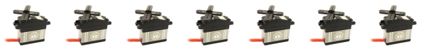

# 168servos

## A resource saving Servo driver for 168 servos for STM32 microcontrollers

- Servo pulses with no jitter
- Resolution 0.1% (1000 steps)
- Period time: 20ms
- Needs only one basic timer with ISR
- Why 168 servos? Beccause 168 is the maximum amount of GPIOs on an STM32
- Demo project for NUCLEOF746ZG board based on the STM32CubeMxIDE

### How to integrate it in your project
- Copy servos.c and servos.h into your project
- Configure Timer6 with a prescaler to get a 1µs base time. Diable autoreaload. See tim.c
- Enable Timer6 IQR with highest priority in the project
- Add the call of SEROS_ISR() in TIM6_DAC_IRQHandler(void) in stm32f7xx_it.c and check if there are no other interrupts that use this handler.
- Call SERVOS_Init() in your main.c
- Configure the servos with SERVOS_Configure();
- Call SERVOS_Task1ms() in a 1ms task

